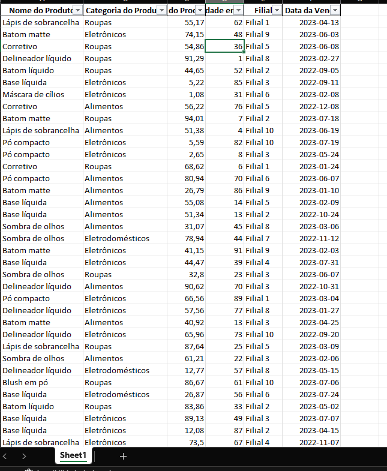

# pipeline_fusao

# Projeto

Nesse projeto de engenharia de dados, temos a missão de carregar fontes de dados de duas empresas diferentes que acabaram de fazer uma fusão para que os demais times possam usar os dados e fazer analises atraves deles.

## Etapas do projeto

1. Preparar o Ambiente de desenvolvimento
2. Carregar/Ler  os dados
3. Transformar os dados
4. Unificaçao dos dados
5. Salvar os dados tratados

## Desenvolvimento de cada etapa

**1. Preparar o Ambiente de desenvolvimento**

Utilizamos o Venv para criamos nosso ambiente Python, e toda o código foi rodado/testado através de uma Maquina Linux (WSL2)

**2 . Carregar/Ler  os dados**

Usamos duas oridem de dados diferentes, um como csv e outro como json, utilizei o pandas para ler os dados:

```py:

path_json = '../data_raw/dados_empresaA.json'
path_csv = '../data_raw/dados_empresaB.csv'
dados_csv_v2 = pd.read_csv(path_csv, delimiter=',')
dados_json_v2 = pd.read_json(path_json)

```

**3. Transformar os dados**

A transformaçao dos dados foi mais simples, a demanda pedia para que os 2 dataframes tivesse os mesmo campos para que facilitasse a unificaçao posteriormente


```py:

dados_csv_v2 = dados_csv_v2.rename(columns={
'Nome do Item':'Nome do Produto',
'Classificação do Produto' :'Categoria do Produto' ,
'Valor em Reais (R$)':'Preço do Produto (R$)',
'Quantidade em Estoque':'Quantidade em Estoque',
'Nome da Loja':'Filial',
'Data da Venda':'Data da Venda'
})
dados_csv_v2['Data da Venda'] = pd.to_datetime(dados_csv_v2['Data da Venda']).dt.date

```

**4. Unificaçao dos dados**

```py:

combinado = pd.concat([dados_csv_v2,dados_json_v2]).reset_index(drop=True)
combinado.fillna({
    'Data da Venda':'Indisponivel'
},inplace=True)

```

**5. Salvar os dados tratados**

```py:

def salvar_arquivo(caminho,arquivo):
    caminho_completo = caminho + arquivo
    with pd.ExcelWriter(caminho_completo) as writer:
        combinado.to_excel(writer,index=False)
    
    return caminho_completo

caminho = '../data_processed/'
arquivo = 'dados_completo.xlsx'

caminho_completo = salvar_arquivo(caminho,arquivo)

```


**Resultado**:




## Observaçoes

O projeto do curso foi feito em Python , mas para fins de treino fiz com a biblioteca pandas.